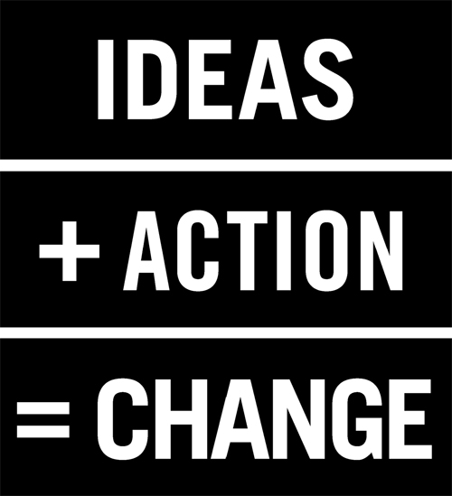

_Also see [HaikuDeck](https://www.haikudeck.com/app/edit/WWkRpnLqqh#)_
### Transforming Genius within through Goal Orientation
_The most powerful answer to KITE's CMQ_
  - IntenseToInsane (**I2I**)
  - Become **`Intense`** about something!
    - intense about information (inquiry), or innovation or inspiration or inclusiveness!
    - Become intensely involved to become insanely great!
      - learn to be like this while you are at KITE, and definitely before you leave!
      
- __Gold medal__ (amass information through inquiry)
- __Hacker__ (amass innovation through projects) 
- __Ideator__ (amass inspiration through voice/blogs/communication)
- __ChangeMaker__ (amass inclusiveness through service, compassion campaigns)
- __Entrepreneur/ CareerChaser/ Scientist/ HE_Learner__ 
  - (some combination of all of the above)

Choose one, and choose well
  - What gets your juices going? Sleep on it! 
  - What do your friends want you to do?
    - but do find like-minded guys to jointly do things
      - Have fun pursuing meaningful things, not movie watching!
  - What do your parents want you to do?
  
### Can I can change my mind, midway?
  - Preferably, no. 
    - But the earlier you commit, the better the success
    - But choose one of the above and be intense about it right away! 

